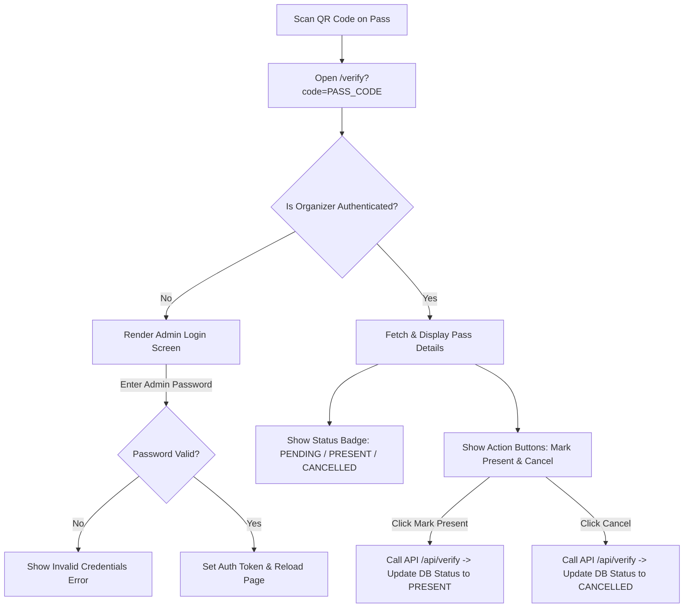

# Implementation Plan: Email Pass Template & Admin QR Verification Portal

## 1. Overview & Core Constraints

This plan outlines the complete modification of the **SC Dandiya 2026 HTML Email Pass** and the implementation of the **Admin QR Verification System**.

### Key Rules & Requirements:
1. **Source Background Image**:
   * Cloudinary URL: `https://res.cloudinary.com/dhrj3rpg8/image/upload/v1789971984/EVENT_PASS.png`
   * Native Canvas Dimensions: **1215 × 1519**.
   * Contains all static graphics, branding (Street Cause Hyderabad, Vision 2030, 17 Years logo), Garba Groove header, "EVENT PASS" title, dancers artwork, white QR box, Terms & Conditions, and footer.
   * **No static HTML/CSS re-creations**: Only overlay dynamic text and the QR code image.
2. **Email System Integrity**:
   * Email sending logic, Nodemailer, API routes, database functions, and data mappings remain **unchanged**.
3. **Responsive Mobile Behavior**:
   * Scales the full **1215 × 1519** canvas proportionally on mobile screens.
   * Columns do **NOT** stack vertically.
4. **Admin Security Requirement**:
   * Scanning the QR code directs to `https://sc-dandiya-2026.vercel.app/verify?code=PASS_CODE`.
   * **Admin Login Gate**: Only authenticated administrators can view pass details and click **Mark Present** or **Cancel**. Unauthorized users see an Admin Authentication Screen.

---

## 2. Dynamic Field & QR Mappings

### A. Dynamic Overlay Fields:

| Field Label | Data Mapping Key | TS/Nodemailer Variable | Sample Value |
| :--- | :--- | :--- | :--- |
| **Name:** | `{{=output["380789549"]["COL$P"]}}` | `record.name` | John Doe |
| **Code:** | `{{=output["380789549"]["COL$A"]}}` | `record.code \|\| record.order_id` | SC-GARBA-001 |
| **mobile:** | `{{=output["380789549"]["COL$O"]}}` | `record.phone` | +91 9876543210 |
| **Email ID:** | `{{=output["380789549"]["COL$N"]}}` | `record.email` | attendee@example.com |
| **Payment mode:**| Constant: `Online` | Constant: `Online` | Online |
| **Type:** | Constant: `Event Pass` | Constant: `Event Pass` | Event Pass |
| **Admits:** | `{{=output["380789549"]["COL$H"]}}` | `record.item_quantity` | 2 |
| **Amount:** | `{{=output["380789549"]["COL$J"]}}/-` | `${record.item_payment_amount}/-` | 500/- |
| **Date:** | Constant: `10 Oct 2026` | Constant: `10 Oct 2026` | 10 Oct 2026 |
| **Venue:** | Constant: `Telangana Gardens,New Bowenpally` | Constant | Telangana Gardens,New Bowenpally |
| **L1's Name:** | `{{=output["380789549"]["COL$S"]}}` | `record.divisions` | Division Alpha |
| **L2's Name:** | `{{=output["380789549"]["COL$T"]}}` | `record.l2` | Volunteer Leader |

### B. Dynamic QR Code:
* **Placement**: Placed inside the existing white square placeholder (Top Right, X: ~880px, Y: ~140px).
* **Target Scanned URL**: `https://sc-dandiya-2026.vercel.app/verify?code=PASS_CODE`
* **QR Image Source**: `https://api.qrserver.com/v1/create-qr-code/?size=250x250&data=${encodeURIComponent(verifyUrl)}`

---

## 3. Visual Layout & Coordinate System (1215 × 1519)

```
+-----------------------------------------------------------------------+
|  [STREET CAUSE HYDERABAD BRANDING & LOGOS]          +---------------+ | Y: 0 - 140px
|                 Garba Groove                        |  DYNAMIC QR   | | 
|                  EVENT PASS                         |   CODE IN     | | Y: 140 - 320px
|                                                     |  WHITE BOX    | | 
|                                                     +---------------+ | 
|  LEFT COLUMN                      RIGHT COLUMN                        | Y: 335 - 560px
|  Name: John Doe                   Admits: 2                           | 
|  Code: SC-GARBA-001               Amount: 500/-                       | 
|  mobile: +91 9876543210           Date: 10 Oct 2026                   | 
|  Email ID: guest@example.com      Venue: Telangana Gardens...         | 
|  Payment mode: Online             L1's Name: Division Alpha           | 
|  Type: Event Pass                 L2's Name: Volunteer Leader         | 
|                                                                       | 
|  [PRE-EXISTING ARTWORK, DANCERS, DASHED DIVIDER & TERMS & CONDITIONS] | Y: 560 - 1519px
|  [FOOTER INSTAGRAM & EMAIL]                                           | 
+-----------------------------------------------------------------------+
```

---

## 4. Admin Auth & Verification Flow (`src/app/verify/page.tsx`)



---

## 5. Complete Standalone HTML Email Template

Below is the complete, email-client compliant replacement HTML template:

```html
<!DOCTYPE html>
<html xmlns="http://www.w3.org/1999/xhtml">
<head>
  <meta charset="utf-8">
  <meta name="viewport" content="width=device-width, initial-scale=1.0">
  <title>Street Cause Hyderabad - Garba Groove Event Pass</title>
  <style>
    html, body { margin: 0 !important; padding: 0 !important; width: 100% !important; background-color: #050a32; font-family: Arial, Helvetica, sans-serif; }
    table { border-collapse: collapse !important; mso-table-lspace: 0pt; mso-table-rspace: 0pt; }
    td { padding: 0; }
    img { display: block; border: 0; outline: none; text-decoration: none; }
    .label-text { font-family: Arial, Helvetica, sans-serif; font-size: 16px; font-weight: 700; color: #ffffff; line-height: 2.1; }
    .value-text { font-family: Arial, Helvetica, sans-serif; font-size: 16px; font-weight: 400; color: #ffffff; line-height: 2.1; }
  </style>
</head>
<body style="margin: 0; padding: 0; background-color: #050a32;">
  <!-- Outer Table Container -->
  <table role="presentation" width="100%" border="0" cellspacing="0" cellpadding="0" style="background-color: #050a32; width: 100%;">
    <tr>
      <td align="center" style="padding: 20px 0;">
        
        <!-- Pass Ticket Canvas Table (1215 x 1519 aspect ratio) -->
        <table role="presentation" width="1215" border="0" cellspacing="0" cellpadding="0" 
               background="https://res.cloudinary.com/dhrj3rpg8/image/upload/v1789971984/EVENT_PASS.png"
               style="width: 100%; max-width: 1215px; background-image: url('https://res.cloudinary.com/dhrj3rpg8/image/upload/v1789971984/EVENT_PASS.png'); background-repeat: no-repeat; background-position: center top; background-size: 100% 100%; border-collapse: collapse;">
          
          <!-- TOP ROW: QR CODE IN TOP RIGHT WHITE BOX -->
          <tr>
            <td width="70%" style="vertical-align: top; padding-top: 140px; padding-left: 45px;">
              &nbsp;
            </td>
            <td width="30%" style="vertical-align: top; padding-top: 140px; padding-right: 55px; text-align: right;">
              
            </td>
          </tr>

          <!-- DYNAMIC FIELDS OVERLAY ROW -->
          <tr>
            <td colspan="2" style="vertical-align: top; padding-top: 15px; padding-left: 45px; padding-right: 45px; padding-bottom: 950px;">
              <table role="presentation" width="100%" border="0" cellspacing="0" cellpadding="0">
                <tr>
                  
                  <!-- LEFT COLUMN -->
                  <td width="48%" style="vertical-align: top; font-family: Arial, Helvetica, sans-serif; font-size: 16px; color: #ffffff;">
                    <div><span class="label-text">Name:</span> <span class="value-text">{{=output["380789549"]["COL$P"]}}</span></div>
                    <div><span class="label-text">Code:</span> <span class="value-text">{{=output["380789549"]["COL$A"]}}</span></div>
                    <div><span class="label-text">mobile:</span> <span class="value-text">{{=output["380789549"]["COL$O"]}}</span></div>
                    <div><span class="label-text">Email ID:</span> <span class="value-text">{{=output["380789549"]["COL$N"]}}</span></div>
                    <div><span class="label-text">Payment mode:</span> <span class="value-text">Online</span></div>
                    <div><span class="label-text">Type:</span> <span class="value-text">Event Pass</span></div>
                  </td>

                  <!-- SPACING COLUMN -->
                  <td width="4%">&nbsp;</td>

                  <!-- RIGHT COLUMN -->
                  <td width="48%" style="vertical-align: top; font-family: Arial, Helvetica, sans-serif; font-size: 16px; color: #ffffff;">
                    <div><span class="label-text">Admits:</span> <span class="value-text">{{=output["380789549"]["COL$H"]}}</span></div>
                    <div><span class="label-text">Amount:</span> <span class="value-text">{{=output["380789549"]["COL$J"]}}/-</span></div>
                    <div><span class="label-text">Date:</span> <span class="value-text">10 Oct 2026</span></div>
                    <div><span class="label-text">Venue:</span> <span class="value-text">Telangana Gardens,New Bowenpally</span></div>
                    <div><span class="label-text">L1's Name:</span> <span class="value-text">{{=output["380789549"]["COL$S"]}}</span></div>
                    <div><span class="label-text">L2's Name:</span> <span class="value-text">{{=output["380789549"]["COL$T"]}}</span></div>
                  </td>

                </tr>
              </table>
            </td>
          </tr>

        </table>

      </td>
    </tr>
  </table>
</body>
</html>
```

---

## 6. Implementation Steps

1. **Modify `src/lib/emailService.ts`**: Update `generatePassEmailHTML` to use the updated table overlay logic and URL-encoded QR code generator.
2. **Extend `src/lib/types.ts` & `src/lib/db.ts`**: Add `attendance_status` field (`'PENDING' | 'PRESENT' | 'CANCELLED'`) and `updateAttendanceStatus` method.
3. **Create API Endpoint `src/app/api/verify/route.ts`**:
   * `GET /api/verify?code=...`: Authenticate admin and return pass details.
   * `POST /api/verify`: Authenticate admin and process action (`PRESENT` or `CANCELLED`).
4. **Create Verification UI Page `src/app/verify/page.tsx`**:
   * Built-in Admin Login form (Secret Key / Passcode authentication).
   * Organizer Dashboard with guest details, current check-in status, **Mark Present** and **Cancel** buttons.
